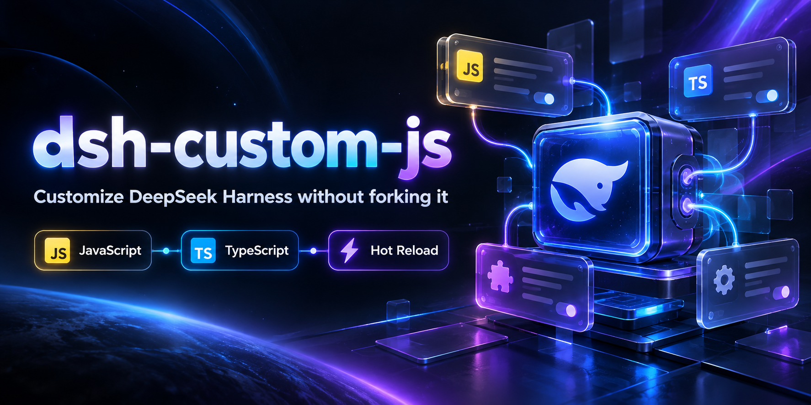
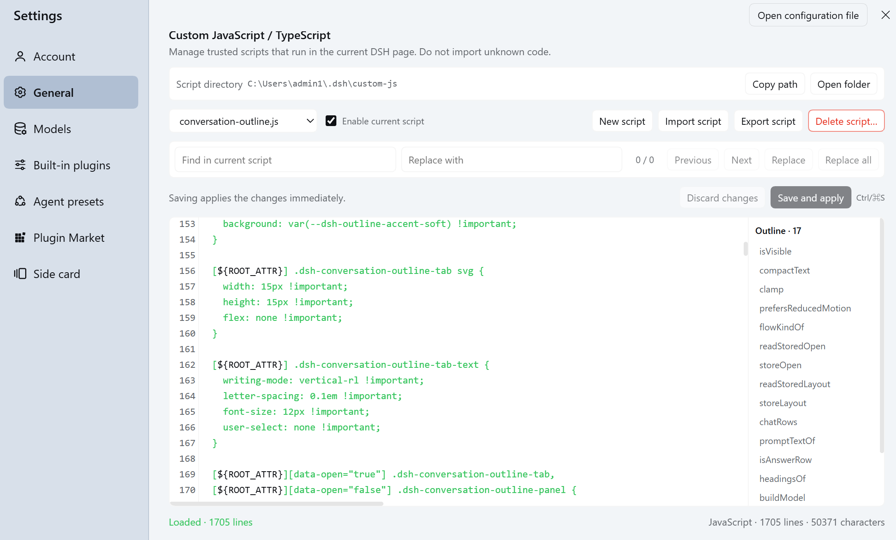
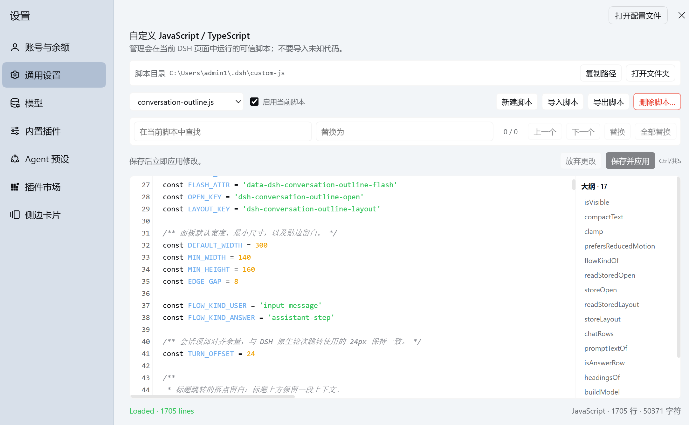
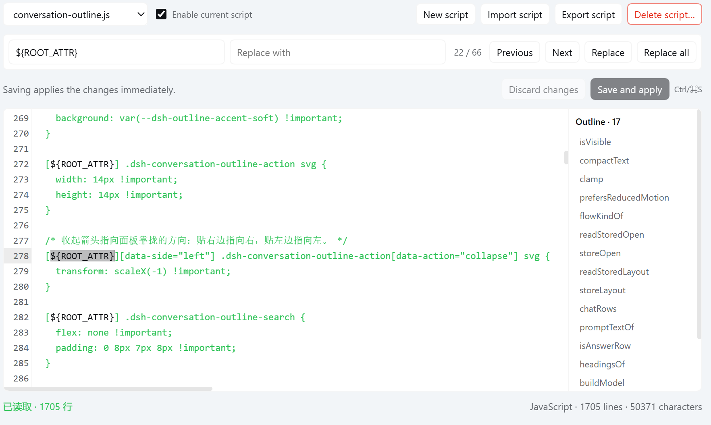
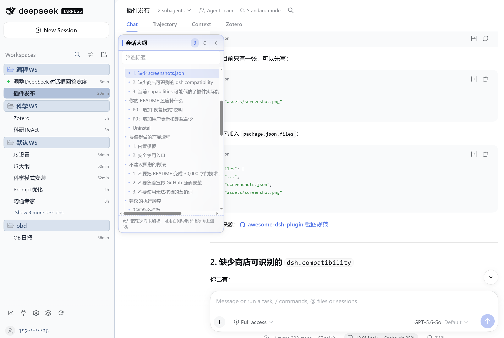

<p align="center">
  
</p>

<h1 align="center">dsh-custom-js</h1>

<p align="center"><strong>为 DeepSeek Harness 加载和管理自己的 JavaScript / TypeScript 用户脚本。</strong></p>

<p align="center">
  <a href="https://www.npmjs.com/package/dsh-custom-js"></a>
  <a href="https://www.npmjs.com/package/dsh-custom-js"></a>
  <a href="https://github.com/jeffreyren1/dsh-custom-js/actions/workflows/ci.yml"></a>
  <a href="https://github.com/jeffreyren1/dsh-custom-js"></a>
  <a href="LICENSE"></a>
</p>

<p align="center"><a href="README.md">English</a> | <strong>中文</strong></p>



`dsh-custom-js` 会把可信的 `.js`、`.mjs` 和 `.ts` 用户脚本加载到 DeepSeek Harness Web GUI 中。插件提供内置脚本管理器、自动重新加载、逐脚本启用/禁用、生命周期 cleanup、TypeScript 转译、运行状态，以及基于 DSH 原生 locale 服务的中英文界面。

插件保持通用，不内置 Settings 窗口形态、Sidebar 按钮、快捷键或页面行为修改。这些具体功能由你自己的用户脚本实现。

|英文版|中文版|
|---|---|
|||

## 安装

```bash
dsh plugin --profile <profile> add dsh-custom-js
```

例如：

```bash
dsh plugin --profile web add dsh-custom-js
```

首次安装后重启 DSH，然后打开 **设置 → 通用设置 → 自定义 JavaScript / TypeScript**。

当前包声明兼容 **DSH `>=0.2.0-rc.1 <0.3.0-0`**，覆盖 `0.2.0-rc.1` 及后续 `0.2.x` 预发布和正式版本，适用于基于 `web` 模板的 profile。

## 更新

```bash
dsh plugin --profile web update dsh-custom-js
```

更新完成后重启当前 DSH 进程，然后刷新浏览器页面。

## 卸载

```bash
dsh plugin --profile web remove dsh-custom-js
```

移除插件后请重启当前 DSH 进程。卸载插件不会删除 `$DSH_HOME/custom-js/` 及其中保存的用户脚本。只有在确认不再需要这些内容时，才手动删除该目录。

## 快速开始

打开 **设置 → 通用设置 → 自定义 JavaScript / TypeScript**，创建 `hello.js` 并粘贴：

```js
console.log('Hello from dsh-custom-js')
```

保存脚本。启用自动重新加载时，Host 会检测变化，Client 会立即加载脚本。

你也可以使用自己喜欢的编辑器，直接在 `$DSH_HOME/custom-js/hello.js` 创建同样的文件。

## 可以用它做什么

可以使用用户脚本调整 DSH Web GUI、增加快捷键和辅助控件、保存长期使用的调试工具，或者维护自己的小型界面扩展，同时避免直接修改 DSH 安装文件。

## 更多截图

### 内置编辑器中的查找与替换

无需离开 DSH 设置页面，即可查找或替换代码。



### 使用自己的脚本扩展 DSH 功能

这个大纲视图由用户自己编写的 JavaScript 文件实现，并通过 `dsh-custom-js` 加载。



## 功能

- JavaScript、MJS、TypeScript 用户脚本
- 内置 CodeMirror 编辑器，支持 JavaScript / TypeScript 语法高亮、行号、括号匹配和编辑历史
- `Ctrl/Cmd+S`、Tab 缩进、查找与替换、代码大纲跳转
- 安全优先的导入：新导入脚本在检查并手动启用前保持禁用
- 导出、删除、逐脚本启用/禁用，以及运行错误后的上下文重试
- 复制脚本目录路径和安全地打开文件夹
- 文件 watcher 与低频轮询，兼容外部编辑器保存方式
- TypeScript ES2022 Module 转译与编译错误定位
- `default` / `apply` / `init` 生命周期与 cleanup
- revision 并发保护，避免覆盖外部编辑的新内容
- 逐脚本运行状态
- `window.dshCustomJs` 浏览器 API
- 通过 `@deepseek-ai/dsh-client-locale` 提供中英文界面

## 安全警告

> [!WARNING]
> **这里只应放入你自己编写或完全信任的代码。**

用户脚本与当前 DSH 页面拥有相同的浏览器侧权限，可以读取和修改页面 DOM、读写 `localStorage` / `sessionStorage`、读取页面中浏览器可见的数据，并通过 `fetch`、`WebSocket` 等 API 发起网络请求。`dsh-custom-js` 不提供用户脚本沙箱。

Host 管理接口和脚本接口经过 DSH Connection request fence；通过检查的用户脚本仍拥有上述浏览器权限。

## 故障恢复

如果某个用户脚本导致 DSH Web GUI 无法正常工作：

1. 停止当前 DSH 进程。
2. 打开 `$DSH_HOME/custom-js/`（通常为 `~/.dsh/custom-js/`）。
3. 重命名问题脚本，例如将 `outline.js` 改为 `outline.js.disabled`。
4. 重新启动 DSH，然后刷新浏览器页面。

插件只加载目录顶层的 `.js`、`.mjs` 和 `.ts` 文件，因此重命名后的文件不会执行，同时其内容仍可用于检查和修复。如果配置了其他 `scriptDirectory`，请改用对应目录。

## 脚本目录

默认目录：

```text
$DSH_HOME/custom-js/
```

如果没有设置 `DSH_HOME`，Host 使用 `~/.dsh/custom-js/`。目录会在插件启动时自动创建。

```text
custom-js/
├─ base.ts
├─ sidebar.js
├─ settings-window.js
└─ shortcuts.mjs
```

只扫描目录顶层的 `.js`、`.mjs`、`.ts` 文件。子目录和其他扩展名会被忽略。`scriptDirectory` 相对于 `$DSH_HOME`，绝对路径和通过 `..` 逃出 `$DSH_HOME` 的路径会被拒绝。

## 脚本管理器

打开 **设置 → 通用设置 → 自定义 JavaScript / TypeScript**。

管理器提供脚本选择、JS/TS 类型和文件大小信息、直接显示的新建/导入/导出/删除操作、安全打开脚本目录、限时删除确认、CodeMirror 语法高亮编辑器、查找与替换、代码大纲跳转、逐脚本启用/禁用、错误后的上下文重试、TypeScript 编译错误、运行状态以及 revision 冲突保护。

编辑器使用显式保存，避免输入尚未完成的 JavaScript 时立即执行。保存启用中的脚本时，按钮显示“保存并应用”，而且即使关闭外部文件自动重载，新版本也会立即生效；保存禁用脚本则只写入文件。新导入脚本会以原子方式创建为禁用状态，便于在启用前检查代码。已保存脚本运行失败时才会显示“重试”；底层 `window.dshCustomJs.reload()` API 仍保留给高级用户。外部文件变化继续遵循 `autoReload` 设置。如果当前编辑器存在未保存内容，会保留本地编辑，直到保存或放弃更改。

逐脚本开关保存在脚本目录中的 `.dsh-custom-js.json`，DSH 重启后继续生效。

## 插件设置

| 设置 | 默认值 | 作用 |
|---|---:|---|
| `enabled` | `true` | 总开关；关闭后清理并卸载全部用户脚本 |
| `autoReload` | `true` | 监听文件变化并通知 Client |
| `scriptDirectory` | `custom-js` | 相对于 `$DSH_HOME` 的目录 |
| `scripts` | `[]` | 优先加载顺序 |
| `scriptStates` | `[]` | 初始逐脚本启用状态 |
| `devLogs` | `false` | 输出详细 Host / Client 加载日志 |

`scripts` 中列出的文件优先按声明顺序加载；其余文件按照 Unicode 文件名稳定升序加载。重复项和不存在的文件会被忽略。没有出现在 `scriptStates` 中的脚本默认启用。

## 普通脚本

文件按浏览器 ES Module 加载，不要求导出函数：

```js
console.log('custom js loaded')

document.addEventListener('click', event => {
  console.log(event.target)
})
```

`.js` 和 `.mjs` 内容由 Host 原样返回。浏览器模块不能使用 `node:fs`、`node:path`、`node:child_process` 等 Node.js API。

## 可管理生命周期

推荐导出默认初始化函数，并返回 cleanup：

```ts
export default function apply(context) {
  const handler = () => console.log('click', context.name)
  document.addEventListener('click', handler)

  return () => {
    document.removeEventListener('click', handler)
  }
}
```

也支持命名导出 `apply` 或 `init`，以及单独的 `cleanup`。初始化优先级为 `default` → `apply` → `init`。脚本重新加载、禁用、删除或插件卸载时会执行 cleanup。整体卸载多个脚本时按照加载顺序的逆序执行 cleanup。

## TypeScript

Host 使用官方 `typescript` 编译器把 `.ts` 转译为浏览器 ES2022 Module，并保留内联 source map。编译错误会写入 manifest，包括文件名、从 1 开始的行号和列号、TypeScript 错误码和消息。单个 TypeScript 文件编译失败不会阻止其他脚本加载。

这里执行单文件转译。如果需要项目级严格类型检查，应在脚本自己的工程中运行 `tsc --noEmit`。

## 浏览器 API

```ts
window.dshCustomJs.version
window.dshCustomJs.scripts
window.dshCustomJs.getStatus('sidebar.ts')
await window.dshCustomJs.sync()
await window.dshCustomJs.reload('sidebar.ts')
await window.dshCustomJs.reload()
```

运行状态包括 `disabled`、`compile-error`、`loading`、`loaded`、`error`、`unloaded`。

## Host 接口

```text
GET  /api/custom-js/manifest
GET  /api/custom-js/scripts/<script>
GET  /api/custom-js/events
GET  /api/custom-js/manage/read?name=<script>
POST /api/custom-js/manage/write
POST /api/custom-js/manage/create
POST /api/custom-js/manage/toggle
POST /api/custom-js/manage/delete
POST /api/custom-js/manage/open-directory
```

管理接口和脚本接口共用 DSH Connection request fence。脚本名称必须是单层 `.js`、`.mjs` 或 `.ts` 文件名；目录穿越和符号链接会被拒绝。编辑请求体上限为 2 MiB，写入使用 revision 前置条件。`create` 接受 `enabled` 布尔值，使导入文件可以在第一次 manifest 更新前就以禁用状态落盘。`open-directory` 只会打开固定脚本目录，绝不会调用操作系统对脚本文件的默认处理程序。

## 中英文界面

DSH 自带 Client locale 服务。`dsh-custom-js` 按照官方 API 注册完整的 `zh` 和 `en` 双语词典，命名空间为 `settings.custom-js`。通过 slot 注册 UI 时设置 `locale: 'settings.custom-js'`，组件使用标准 `t` 文案入口后，用户切换 DSH 语言时界面会自动更新，无需重新加载。

相关文件：

```text
src/client/locales.ts
src/client/i18n.ts
```

Client 入口需要在 Cordis `inject` 中包含 `locale`，并在 `apply(ctx)` 中调用 `installCustomJsLocale(ctx)`。

## 验证情况

已通过自动检查验证：

- TypeScript 类型检查
- 编译器、Host manager、Client manager、设置行为和 HTTP 路由自动化测试
- Host 与 Client 的生产构建
- 使用 `npm pack --dry-run` 检查 npm 发布包内容

已在 **Windows 11 + DSH 0.2.0-rc.1** 环境中手动验证：

- 无需兼容性豁免即可将 `.tgz` 安装到隔离的 `web` profile
- 插件清单能识别 `custom-js` 组件及其 Host/Client 导出
- DSH 启动以及 manifest、TypeScript 创建/编译/提供、禁用和删除烟雾检查
- 创建和编辑脚本
- 自动重新加载
- TypeScript 诊断
- 外部编辑器更新

目前尚未验证：

- macOS
- Linux 桌面环境下打开文件夹
- 尚未发布的未来 `0.2.x` 构建；声明的 peer range 会接受它们，但不会接受 DSH `0.3.x`

## 开发

```bash
pnpm install
pnpm typecheck
pnpm test
pnpm build
```

## 发布

发布前检查：

```bash
pnpm typecheck
pnpm test
npm pack --dry-run
```

发布：

```bash
npm publish
```

`prepublishOnly` 会执行类型检查和测试，`prepack` 会重新构建 `lib`。

## 贡献与支持

- 遇到问题或有新想法？请[提交 Issue](https://github.com/jeffreyren1/dsh-custom-js/issues)。
- 希望参与贡献？请阅读 [CONTRIBUTING.md](CONTRIBUTING.md)。
- 如需私下报告安全漏洞，请遵循 [SECURITY.md](SECURITY.md)。
- 版本变更记录见 [CHANGELOG.md](CHANGELOG.md)。

如果这个插件对你有帮助，欢迎为仓库点 Star，这会帮助更多 DSH 用户发现它。

## License

[MIT](LICENSE)

## 链接

- GitHub: <https://github.com/jeffreyren1/dsh-custom-js>
- Issues: <https://github.com/jeffreyren1/dsh-custom-js/issues>
- npm: <https://www.npmjs.com/package/dsh-custom-js>
- DeepSeek Harness: <https://github.com/deepseek-ai/deepseek-harness>
